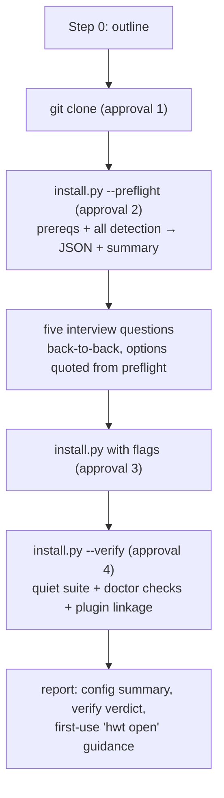

# feat: Two-command agent install (preflight + verify)

## Summary

Add `--preflight` and `--verify` modes to `install.py` so the agent-driven install performs all machine detection in one approved command and all verification in another, then rewrite `AGENT_INSTRUCTIONS.md` around them — dropping the flow from dozens of approval-prompting commands to roughly four, with the live workspace check deferred to the user's first real `hwt open`.

---

## Problem Frame

Teammates install Corral by pointing a coding agent at `AGENT_INSTRUCTIONS.md`. The instructions make the agent improvise 10–20 detection commands across the five-question interview and four separate verification commands afterward — each a tool call, an approval prompt, and an LLM round-trip. The felt slowness is that grind; the test suite itself runs in ~0.3s and is not the cost (see origin: docs/brainstorms/2026-08-13-faster-install-requirements.md). Approvals belong to the user's harness and cannot be pre-granted, so the fix is structural: fewer, larger commands.

---

## Requirements

Carried from the origin document; IDs preserved.

**Preflight detection**

- R1. One read-only preflight invocation performs the Step 1 prerequisite checks (Python version, `git`, `herdr` presence/version, agent CLIs) and every Step 2 investigation: candidate repository parent folders with repository counts, Herdr's worktree directory and existing worktree collections, network name candidates (tailscale DNS name/IPv4, hostname), usable agent kinds, existing Herdr keybindings plus a free-key suggestion for the palette binding.
- R2. Preflight output is dual-format: machine-readable JSON plus a short human summary.
- R3. Preflight writes nothing — safe to approve blind.
- R4. Agent-CLI detection replicates the three-way probe (PATH lookup, login+interactive shell with timeout, per-vendor bin globs).

**Verification**

- R5. One verify invocation replaces the four Step 4 commands: quiet unit suite (output only on failure), doctor-equivalent environment checks, plugin linked + enabled with `cleanup` and `palette` actions — one overall pass/fail verdict.
- R6. The live workspace check leaves the install flow; the final report tells the user to run `hwt open <repository>` when ready, what to expect (exactly `agent`, `shell`, `server` tabs), and where to file an issue if a rerun duplicates the workspace.

**Instructions rewrite**

- R7. `AGENT_INSTRUCTIONS.md` Step 2 becomes "run preflight, then ask the five questions from its output"; Step 4 becomes the single verify command; the five questions and Step 5 are unchanged.
- R8. The Step 0 outline reflects the smaller surface (~4 command approvals).

---

## Key Technical Decisions

- **Preflight and verify are modes of `install.py`, not a separate script or an `hwt doctor` mode.** Preflight must run from a fresh clone before the `hwt` launcher exists on PATH, and the repo's convention is two Python files. `python3 <clone>/install.py --preflight` works at every point in the flow. Trade-off accepted in the origin synthesis: `install.py` roughly doubles in size.
- **`install.py` stays self-contained and standard-library-only.** It does not import `hwt.py`; the ~15 lines of Herdr config parsing (worktree directory, keybindings via `tomllib`) are duplicated rather than shared, per CONTRIBUTING's "no manager layers" and the existing no-import boundary between the two files. Herdr's config path resolution is `$XDG_CONFIG_HOME/herdr/config.toml`, else `~/.config/herdr/config.toml` — mirror `hwt.py`'s `corral_palette_keybinding` handling, but import `tomllib` lazily inside the config reader (try/except ImportError degrading the Herdr-config fields to null): `tomllib` exists only from Python 3.11, and a module-top import would crash preflight with a traceback on exactly the too-old machines the Python prerequisite check exists to report.
- **JSON on stdout, human summary on stderr.** Matches the `hwt` convention (results to stdout, `log()` to stderr): agents parse stdout, humans read the terminal either way.
- **Detection failures degrade, never block.** A missing `tailscale`, an rc file that hangs the login-shell probe (guard with a subprocess timeout of a few seconds), or an unreadable Herdr config each produce a partial report with that field marked absent — preflight always exits 0 with whatever it found. Only the verify command has a failing exit status.
- **Verify runs the suite as a subprocess with captured output.** `python3 -m unittest discover -s tests` from the clone directory; on success the per-test output is discarded, on failure it is printed in full. Plugin linkage is checked through `herdr plugin list` / `herdr plugin action list --plugin corral` JSON.
- **Version 0.18.0.** Behavior-changing release per CONTRIBUTING: bump `herdr-plugin.toml` and `hwt.py:__version__` (consistency test enforces the pair) and add a CHANGELOG entry.

---

## High-Level Technical Design

The new flow, with the only approval-prompting commands marked:

Consent-gated extras (Herdr worktree-directory edit, keybinding append, PATH fix) remain separate approvals only when the user opts in — unchanged from today.

---

## Implementation Units

### U1. Preflight mode in the installer

- **Goal:** `install.py --preflight` emits everything the interview needs in one read-only invocation.
- **Requirements:** R1, R2, R3, R4 (origin AE1).
- **Dependencies:** none.
- **Files:** `install.py`, `tests/test_install.py` (new).
- **Approach:** A `--preflight` flag short-circuits `main()` before any directory creation. Gather: prerequisites (Python version tuple, `git`/`herdr` on PATH, Herdr version); repository parents (scan the conventional candidates — `~/repos`, `~/code`, `~/src`, `~/dev`, `~/projects`, `~/GitRepos`, `~/Documents/GitRepos` — plus one-level `$HOME` directories whose children include several Git repos, reusing `discover_repositories` for counting); Herdr's `[worktrees].directory` and existing worktree collections (Herdr dir, `<repo>__worktrees` siblings, prior Corral `worktree_root`); network candidates (`tailscale status --json` → `.Self.DNSName`, `tailscale ip -4`, `hostname -f`); agent kinds (parse `herdr agent start --help` for accepted kinds, then the three-way usability probe: `shutil.which`, `$SHELL -lic 'command -v …'` with timeout, `~/.*/bin` + `~/.local/bin` globs); keybindings (`[keys]` prefix, `[[keys.command]]` entries, and a free-key suggestion that treats Herdr's built-in default prefix bindings as occupied — embed the static default-key list from Herdr's `validated_keybinds`, since `prefix+w` is Herdr's default workspace picker and a user command binding silently displaces the default it collides with). Emit one JSON object on stdout and a compact human summary on stderr.
- **Patterns to follow:** `discover_repositories` and `git_output` in `install.py`; config-path and TOML handling in `hwt.py`'s `corral_palette_keybinding`.
- **Test scenarios:**
  - Happy path: with a temp `$HOME` containing two fake repo parents and a Herdr config, preflight stdout parses as JSON listing both parents with correct repo counts and the configured worktree directory.
  - Covers AE1. With `tailscale` absent from PATH, the network section contains hostname-derived candidates only and no error.
  - Keybinding suggestion: the suggestion never collides with a user binding or a Herdr default (empty config suggests a genuinely unbound key such as `prefix+u`, not `prefix+w`); an existing `corral.palette` binding is reported as already present.
  - Degradation on old Python: with `tomllib` unavailable (simulate via import patching), preflight still emits its JSON report with the Herdr-config fields null and the Python prerequisite marked failing, exit status 0.
  - Agent probe: a stub agent CLI placed only in a vendor-style bin dir (not PATH) is still reported usable; the login-shell probe surviving a hanging rc file (stub `$SHELL` that sleeps) via timeout.
  - Read-only guarantee: preflight against a temp `$HOME` creates no files or directories (snapshot the tree before/after).
  - Degradation: unreadable/malformed Herdr config yields a report with that field null and exit status 0.
- **Verification:** running `python3 install.py --preflight` on the dev machine prints valid JSON covering all R1 fields and writes nothing.

### U2. Verify mode in the installer

- **Goal:** `install.py --verify` replaces the four verification commands with one quiet verdict.
- **Requirements:** R5 (origin AE2).
- **Dependencies:** U1 (shares option plumbing; lands second).
- **Files:** `install.py`, `tests/test_install.py`.
- **Approach:** Run the unit suite as a captured subprocess from the clone directory; check the `hwt` launcher exists and `--help` succeeds via its absolute path (no PATH dependence); confirm `herdr plugin list` shows `corral` linked and enabled and `herdr plugin action list --plugin corral` includes `cleanup` and `palette`; run the doctor-equivalent environment checks (config dirs exist, configured repo paths are git repos). Print a per-check pass/fail table on stderr, a JSON verdict on stdout, exit nonzero on any failure with the failing check's captured output included. Add a hidden `--verify-tests-dir` option (`help=argparse.SUPPRESS`, following the existing `--skip-plugin` precedent) that overrides the discovered suite directory — without it, tests exercising the real verify path would recursively re-run the full suite including themselves.
- **Patterns to follow:** `run_checked` in `install.py`; `cmd_doctor`'s check-list shape in `hwt.py`.
- **Test scenarios:**
  - Covers AE2. Pointing `--verify-tests-dir` at a stub test directory whose suite fails, the verdict is fail, exit status nonzero, and the unittest output appears; against a passing stub suite, per-test output is absent from both streams.
  - Missing or unlinked plugin (stubbed `herdr` returning an empty plugin list) → fail verdict naming the plugin check.
  - `herdr` absent from PATH → fail verdict with a clear message, not a traceback.
- **Verification:** on the dev machine, `python3 install.py --verify` passes end-to-end and its runtime is dominated by the ~0.3s suite.

### U3. Instructions rewrite and release

- **Goal:** `AGENT_INSTRUCTIONS.md` drives the new two-command flow; release shipped per repo convention.
- **Requirements:** R6, R7, R8 (origin AE3).
- **Dependencies:** U1, U2.
- **Files:** `AGENT_INSTRUCTIONS.md`, `README.md` (only if its agent-install section references the removed workspace check), `CHANGELOG.md`, `herdr-plugin.toml`, `hwt.py` (version constant).
- **Approach:** Step 0 outline now promises ~4 command approvals; Step 1 collapses into "clone, then run preflight"; Step 2 keeps the five questions verbatim but sources every detected option from preflight JSON instead of prescribing detective work; Step 4 becomes the single verify command; the live workspace check paragraph is replaced by Step 6 report guidance — first `hwt open <repository>` is the live check, expect exactly `agent`/`shell`/`server`, file an issue (with `herdr workspace list` output) if a rerun duplicates the workspace. Step 5 untouched. Bump 0.18.0 in both version sites; CHANGELOG entry describing the flow change.
- **Test scenarios:** Test expectation: none — documentation and version metadata; the existing version-consistency test enforces the paired bump.
- **Verification:** a read-through of the rewritten instructions encounters exactly the four approval-prompting commands from the design diagram; no step instructs the agent to run detection commands outside preflight.

---

## Acceptance Examples

Carried from origin, unchanged in intent: AE1 (tailscale-less machine → hostname candidates, no extra detection commands), AE2 (broken environment → failing verdict with output; healthy → quiet), AE3 (first `hwt open` after install shows the three tabs and the report predicted it). U-unit test scenarios reference these where they bind.

---

## Scope Boundaries

- The five interview questions, their consent semantics, and Step 5's per-repository refinement are untouched.
- No harness allowlist or permission guidance to agents — approvals stay user-owned.
- The marketplace `herdr plugin install` path in the README is unaffected.

### Deferred to Follow-Up Work

- The self-contained interactive installer (one-approval floor) — revisit only if this restructure still feels slow in practice (origin decision).

---

## Sources & Research

- Origin requirements: `docs/brainstorms/2026-08-13-faster-install-requirements.md`.
- `install.py` — `discover_repositories`, `git_output`, `run_checked`; currently has no test coverage, so `tests/test_install.py` is new surface.
- `AGENT_INSTRUCTIONS.md` — current Steps 0–6; Step 2's per-question detective work and Step 4's four-command verification are the replaced material.
- `hwt.py` — `corral_palette_keybinding` (Herdr config path + `[keys]` parsing to mirror), `cmd_doctor` (check-list shape).
- `CONTRIBUTING.md` — stdlib-only, no manager layers, mandatory tests, paired version bump + CHANGELOG.
- Herdr source (`src/config/io.rs::config_dir`) — `$XDG_CONFIG_HOME/herdr` else `~/.config/herdr`, verified this session.
- Herdr source (`src/config/keybinds.rs::validated_keybinds` and its defaults) — the default prefix is ctrl+b and roughly twenty `prefix+<letter>` keys are default-bound (including `prefix+w`, the workspace picker); user command bindings silently displace colliding defaults. Source of the static default-key list U1 embeds.
